```mermaid
graph TD
    A[thisisafrica-booking-engine-clean]
    A --> B[.git]
    A --> C[.next]
    A --> D[app]
    A --> E[components_folder]
    A --> F[docs]
    A --> G[hooks]
    A --> H[lib]
    A --> I[node_modules]
    A --> J[public]
    A --> K[scripts]
    A --> L[.env.local]
    A --> M[.env.local-claude]
    A --> N[.env.local-old]
    A --> O[.gitattributes]
    A --> P[.gitignore]
    A --> Q[.npm-config]
    A --> R[.npmrc]
    A --> S[.nvrmc]
    A --> T[check_vpn_jp.py]
    A --> U[components_file]
    A --> V[.env.vercel]
    A --> W[env-template]
    A --> X[next.config.mjs]
    A --> Y[next-env.d.ts]

    C --> C1[cache]
    C --> C2[server]
    C --> C3[static]
    C --> C4[types]
    C --> C5[app-build-manifest]
    C --> C6[build-manifest]
    C --> C7[fallback-build-manifest]
    C --> C8[package]
    C --> C9[react-loadable-manifest]
    C --> C10[trace]

    C1 --> C1_1[fetch-cache]
    C1 --> C1_2[swc]
    C1 --> C1_3[webpack]

    C2 --> C2_1[app]
    C2 --> C2_2[pages]
    C2 --> C2_3[vendor-chunks]
    C2 --> C2_4[_error.js]
    C2 --> C2_5[app-paths-manifest]
    C2 --> C2_6[interception-route-rewrite-manifest]
    C2 --> C2_7[middleware-build-manifest.js]
    C2 --> C2_8[middleware-manifest]
    C2 --> C2_9[next-font-manifest.js]
    C2 --> C2_10[next-font-manifest]
    C2 --> C2_11[pages-manifest]
    C2 --> C2_12[server-reference-manifest]
    C2 --> C2_13[server-reference-manifest]
    C2 --> C2_14[webpack-runtime.js]

    C3 --> C3_1[chunks]
    C3 --> C3_2[css]
    C3 --> C3_3[development]
    C3 --> C3_4[webpack]

    C4 --> C4_1[app]
    C4 --> C4_2[package]

    B --> B1[hooks]
    B --> B2[info]
    B --> B3[logs]
    B --> B4[objects]
    B --> B5[refs]
    B --> B6[COMMIT_EDITMSG]
    B --> B7[config]
    B --> B8[description]
    B --> B9[FETCH_HEAD]
    B --> B10[HEAD]
    B --> B11[index]
    B --> B12[ORIG_HEAD]

    A --> Z[package.json]
    A --> AA[package-lock.json]
    A --> BB[PLANNING.MD]
    A --> CC[pnpm-lock.yaml]
    A --> DD[pnpm-workspace.yaml]
    A --> EE[postcss.config.mjs]
    A --> FF[README.md]
    A --> GG[RESEND_SETUP_GUIDE.md]
    A --> HH[SECURITY.md]
    A --> II[setup-env.md]
    A --> JJ[STRIPE_SETUP.md]
    A --> KK[tailwind.config.js]
    A --> LL[TASK.md]
    A --> MM[test_agent_auth.py]
    A --> NN[test_complete_setup.py]
    A --> OO[test_dns_routing.py]
    A --> PP[test_hostconnect_search.py]
    A --> QQ[test_option_info_request.py]
    A --> RR[test_real_tourplan_search.py]
    A --> SS[test_search_xml_format.py]
    A --> TT[test_tourplan_api.py]
    A --> UU[test_tourplan_complete.py]
    A --> VV[test_user_option_info_request.py]
    A --> WW[test-api-interface]
    A --> XX[test-option-info]
    A --> YY[test-search-real-data]
    A --> ZZ[tourplan_test_report_20250625_115936]
    A --> AAA[tsconfig.json]
    A --> BBB[user_option_info_test_report_20250625_115936]
    A --> CCC[vercel]
    A --> DDD[VERCEL_DEPLOYMENT.md]
```

    C4_1 --> C4_1_1[api]
    C4_1 --> C4_1_2[productdetails]
    C4_1 --> C4_1_3[layout]
    C4_1 --> C4_1_4[page]

    C4_1_2 --> C4_1_2_1[page]

    C4_1_1 --> C4_1_1_1[tourplan]

    C4_1_1_1 --> C4_1_1_1_1[product]
    C4_1_1_1 --> C4_1_1_1_2[route]

    C4_1_1_1_1 --> C4_1_1_1_1_1[[code]]

    C4_1_1_1_1_1 --> C4_1_1_1_1_1_1[route]

    C4_1_1_1 --> C4_1_1_1_3[direct]
    C4_1_1_1 --> C4_1_1_1_4[option-info]
    C4_1_1_1 --> C4_1_1_1_5[search]
    C4_1_1_1 --> C4_1_1_1_6[test]
    C4_1_1_1 --> C4_1_1_1_7[route]

    C4_1_1_1_3 --> C4_1_1_1_3_1[route]
    C4_1_1_1_4 --> C4_1_1_1_4_1[route]
    C4_1_1_1_5 --> C4_1_1_1_5_1[route]

    D --> D1[api]
    D --> D2[payment]
    D --> D3[productdetails]
    D --> D4[layout]
    D --> D5[page]

    D1 --> D1_1[tours]
    D1 --> D1_2[verify-payment]

    D1_1 --> D1_1_1[availability]
    D1_1 --> D1_1_2[search]

    D1_1_1 --> D1_1_1_1[route]
    D1_1_2 --> D1_1_2_1[route]

    D1_2 --> D1_2_1[route]

    D2 --> D2_1[cancel]
    D2 --> D2_2[success]
    D2 --> D2_3[page]

    D2_1 --> D2_1_1[page]

    D2_2 --> D2_2_1[loading]
    D2_2 --> D2_2_2[page]

    D3 --> D3_1[page]

    E --> E1[ui]
    E --> E2[booking-confirmation.tsx]
    E --> E3[booking-form.tsx]
    E --> E4[enhanced-search-form.tsx]
    E --> E5[featured-tours.tsx]
    E --> E6[footer.tsx]
    E --> E7[header.tsx]
    E --> E8[payment-form.tsx]
    E --> E9[search-form.tsx]
    E --> E10[theme-provider.tsx]
    E --> E11[tour-results.tsx]

    E1 --> E1_1[accordion.tsx]
    E1 --> E1_2[alert.tsx]
    E1 --> E1_3[alert-dialog.tsx]
    E1 --> E1_4[aspect-ratio.tsx]
    E1 --> E1_5[avatar.tsx]
    E1 --> E1_6[badge.tsx]
    E1 --> E1_7[breadcrumb.tsx]
    E1 --> E1_8[button.tsx]
    E1 --> E1_9[calendar.tsx]
    E1 --> E1_10[card.tsx]
    E1 --> E1_11[carousel.tsx]
    E1 --> E1_12[chart.tsx]
    E1 --> E1_13[checkbox.tsx]
    E1 --> E1_14[collapsible.tsx]
    E1 --> E1_15[command.tsx]
    E1 --> E1_16[context-menu.tsx]
    E1 --> E1_17[dialog.tsx]
    E1 --> E1_18[drawer.tsx]
    E1 --> E1_19[dropdown-menu.tsx]
    E1 --> E1_20[form.tsx]
    E1 --> E1_21[hover-card.tsx]
    E1 --> E1_22[input.tsx]
    E1 --> E1_23[input-otp.tsx]
    E1 --> E1_24[label.tsx]
    E1 --> E1_25[menubar.tsx]
    E1 --> E1_26[navigation-menu.tsx]
    E1 --> E1_27[pagination.tsx]
    E1 --> E1_28[popover.tsx]
    E1 --> E1_29[progress.tsx]
    E1 --> E1_30[radio-group.tsx]
    E1 --> E1_31[resizable.tsx]
    E1 --> E1_32[scroll-area.tsx]
    E1 --> E1_33[select.tsx]
    E1 --> E1_34[separator.tsx]
    E1 --> E1_35[sheet.tsx]
    E1 --> E1_36[sidebar.tsx]
    E1 --> E1_37[skeleton.tsx]
    E1 --> E1_38[slider.tsx]
    E1 --> E1_39[sonner.tsx]
    E1 --> E1_40[switch.tsx]
    E1 --> E1_41[table.tsx]
    E1 --> E1_42[tabs.tsx]
    E1 --> E1_43[textarea.tsx]
    E1 --> E1_44[toast.tsx]
    E1 --> E1_45[toaster.tsx]
    E1 --> E1_46[toggle.tsx]
    E1 --> E1_47[toggle-group.tsx]
    E1 --> E1_48[tooltip.tsx]
    E1 --> E1_49[use-mobile.tsx]
    E1 --> E1_50[use-toast.tsx]

    F --> F1[AWS_SETUP_GUIDE.md]
    F --> F2[Complete List of Tourplan HostConnect.pdf]
    F --> F3[connection-troubleshooting.md]
    F --> F4[EC2_IP_ASSOCIATION_GUIDE.md]
    F --> F5[EC2_SETUP_GUIDE.md]
    F --> F6[HostConnect-Error-Codes-Version-5.0.pdf]
    F --> F7[HostConnect-Version-5.000-DTD.pdf]
    F --> F8[HostConnect-Versions-5.05.000-Interface-Specification.pdf]
    F --> F9[OPTION_INFO_REQUEST_TEST_RESULTS.md]
    F --> F10[QUICK_REFERENCE.md]
    F --> F11[Request-Examples.pdf]
    F --> F12[security-group-setup.md]
    F --> F13[SSH_CONNECTION_GUIDE.md]
    F --> F14[SUCCESSFUL_SSH_CONNECTION.md]
    F --> F15[Tourplan API Booking Engine Limitations.pdf]
    F --> F16[TOURPLAN_API_TESTING_GUIDE.md]
    F --> F17[TOURPLAN_IP_WHITELIST_REQUEST.md]
    F --> F18[tourplan-api-dashboard.txt]
    F --> F19[tourplan-api-examples.txt]
    F --> F20[tourplan-dtd.txt]
    F --> F21[tourplan-error-codes.txt]
    F --> F22[tourplan-interface-definition.txt]
    F --> F23[VPN_IP_WHITELISTING_GUIDE.md]

    G --> G1[use-mobile.tsx]
    G --> G2[use-toast.tsx]
    G --> G3[useTourplanSearch.tsx]

    H --> H1[api]
    H --> H2[mocks]
    H --> H3[cache]
    H --> H4[config]
    H --> H5[database]
    H --> H6[email-service]
    H --> H7[env]
    H --> H8[ip-checker]
    H --> H9[paymentAPI.js]
    H --> H10[payment-service]
    H --> H11[pdf-service]
    H --> H12[resend-email-service]
    H --> H13[simplified-local-image-service]
    H --> H14[stripe-client]
    H --> H15[testTourplanAPI.js]
    H --> H16[tourplan.js]
    H --> H17[tourplan-api.js]
    H --> H18[tourplan-api-debug.js]
    H --> H19[utils]

    H1 --> H1_1[payment]
    H1 --> H1_2[tourplan]
    H1 --> H1_3[tyro]
    H1 --> H1_4[utils]
    H1 --> H1_5[config.js]

    H1_1 --> H1_1_1[stripe]
    H1_1 --> H1_1_2[paymentClient.js]

    H1_2 --> H1_2_1[tourplanClient.js]
    H1_2 --> H1_2_2[xmlTourplanClient.js]

    H1_2_1 --> H1_2_1_1[tourplan-api-debug.js]
    H1_2_1 --> H1_2_1_2[tourplan-api.js]
    H1_2_1 --> H1_2_1_3[tourplan.js]
    H1_2_2 --> H1_2_2_1[xmlTourplanClient.js]

    H1_3 --> H1_3_1[tyroClient.js]

    H1_4 --> H1_4_1[format.js]
    H1_4_1 --> H1_4_1_1[format.js]

    H2 --> H2_1[data]
    H2 --> H2_2[handlers]
    H2 --> H2_3[index.js]

    H2_1 --> H2_1_1[tourplan-mock-data.js]

    H2_2 --> H2_2_1[tourplan-mock-handler.js]

    H3 --> H3_1[cache.js]

    H4 --> H4_1[index.js]

    H5 --> H5_1[db.js]

    H6 --> H6_1[index.js]

    H7 --> H7_1[index.js]

    H8 --> H8_1[index.js]

    H10 --> H10_1[index.js]

    H11 --> H11_1[index.js]

    H12 --> H12_1[index.js]

    H13 --> H13_1[index.js]

    H14 --> H14_1[index.js]

    H19 --> H19_1[index.js]

    I --> I1[axios]
    I --> I2[next]
    I --> I3[react]
    I --> I4[stripe]
    I --> I5[tailwindcss]

    J --> J1[favicon.ico]
    J --> J2[next.svg]
    J --> J3[vercel.svg]

    K --> K1[generate-sitemap.js]
    K --> K2[post-build.js]
    K --> K3[pre-build.js]

    WW --> WW1[test-api-interface.js]
    XX --> XX1[test-option-info.js]
    YY --> YY1[test-search-real-data.js]
    ZZ --> ZZ1[tourplan_test_report_20250625_115936.html]
    BBB --> BBB1[user_option_info_test_report_20250625_115936.html]
    CCC --> CCC1[config]
    CCC --> CCC2[output]

    CCC1 --> CCC1_1[build-output.json]

    CCC2 --> CCC2_1[static]

    CCC2_1 --> CCC2_1_1[index.html]

    I --> I6[ts-interface-checker]
    I --> I7[typescript]
    I --> I8[uncrypto]
    I --> I9[undici-types]
    I --> I10[update-browserslist-db]
    I --> I11[url]
    I --> I12[use-callback-ref]
    I --> I13[use-sidecar]
    I --> I14[use-sync-external-store]
    I --> I15[util]
    I --> I16[util-deprecate]
    I --> I17[vaul]
    I --> I18[victory-vendor]
    I --> I19[webidl-conversions]
    I --> I20[whatwg-url]
    I --> I21[which]
    I --> I22[wrap-ansi]
    I --> I23[wrap-ansi-cjs]
    I --> I24[ws]
    I --> I25[xml2js]
    I --> I26[xmlbuilder]
    I --> I27[xml-js]
    I --> I28[xtend]
    I --> I29[yaml]
    I --> I30[zod]
    I --> I31[.package-lock]

    J --> J4[images]
    J --> J5[pdfs]

    J4 --> J4_1[products]
    J4 --> J4_2[product-image-index]

    J4_1 --> J4_1_1[image_files]

    J5 --> J5_1[products]
    J5 --> J5_2[product-pdf-index]

    J5_1 --> J5_1_1[pdf_files]

    K --> K4[af_product_images.sql]
    K --> K5[af_product_pdf.sql]
    K --> K6[convert-pdf-sql-to-index.js]
    K --> K7[convert-sql-to-index.js]
    K --> K8[create-image-index.js]
    K --> K9[debug-pdf-sql.js]
    K --> K10[inspect-sql.js]
    K --> K11[scan-local-images.js]
    K --> K12[simple-pdf-debug.js]
    K --> K13[simple-pdf-parser.js]

